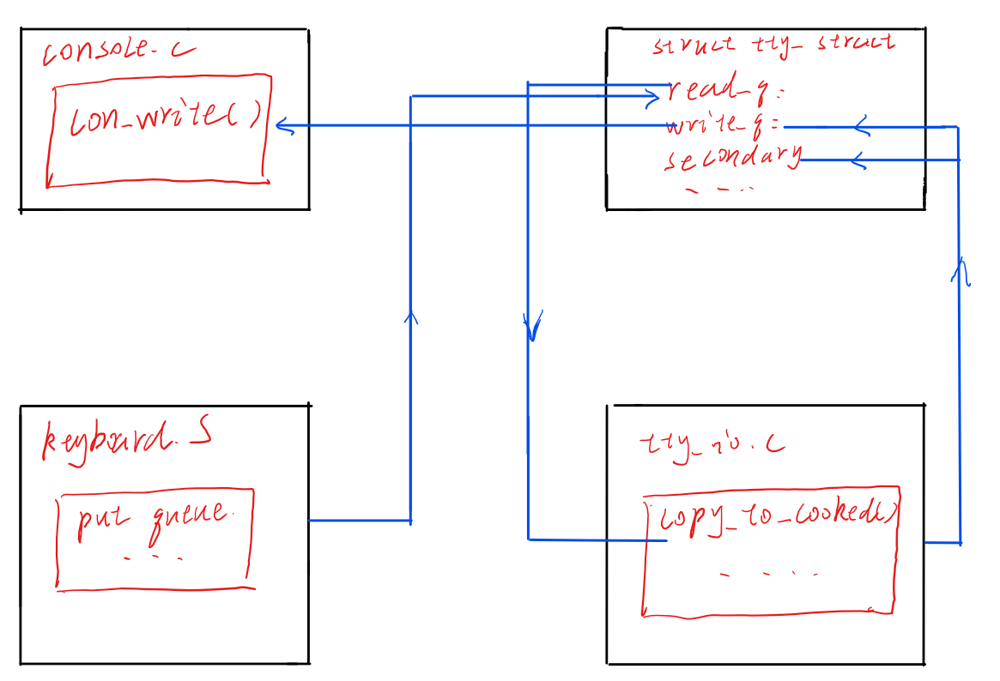
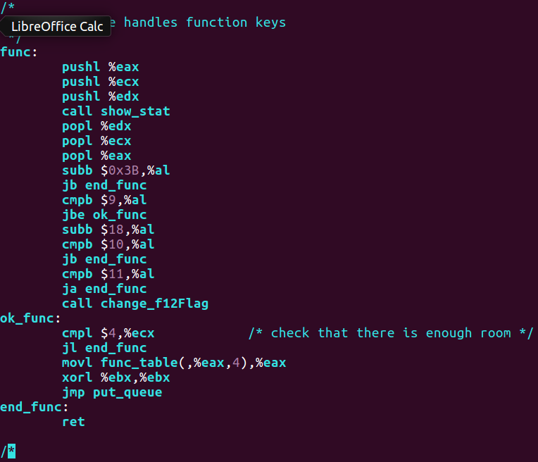
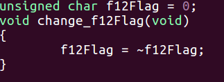
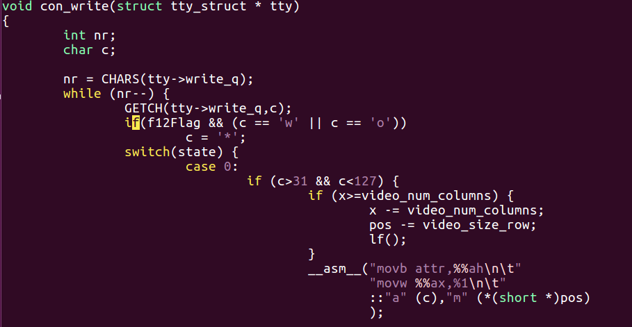
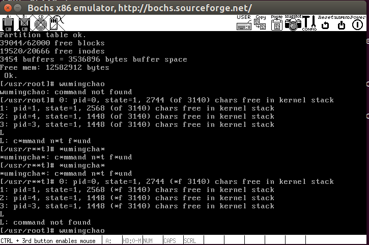
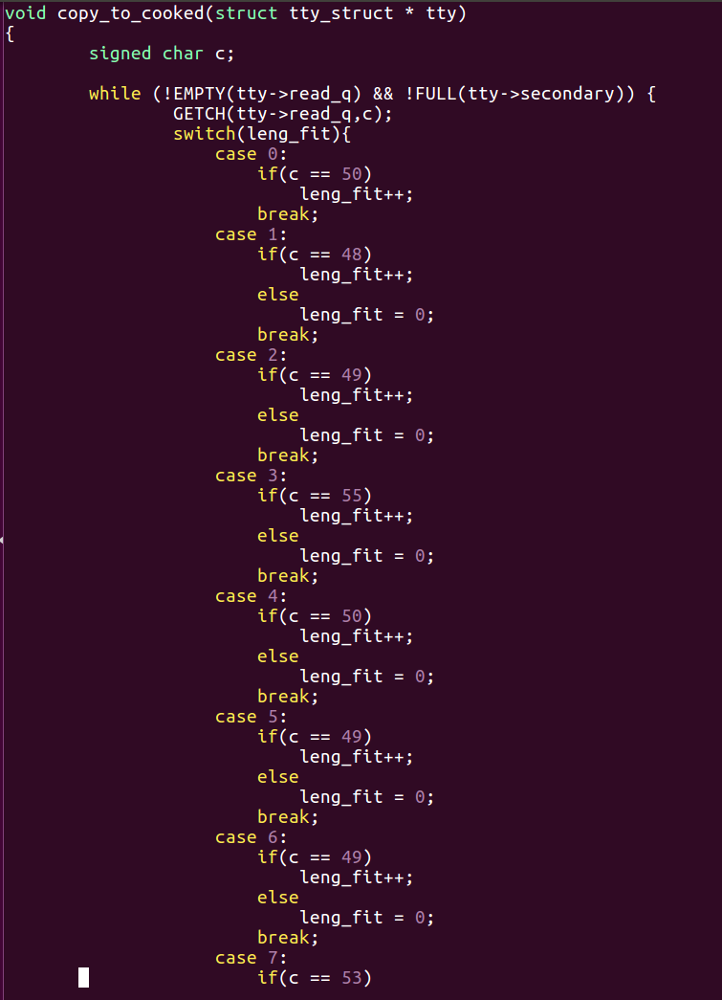
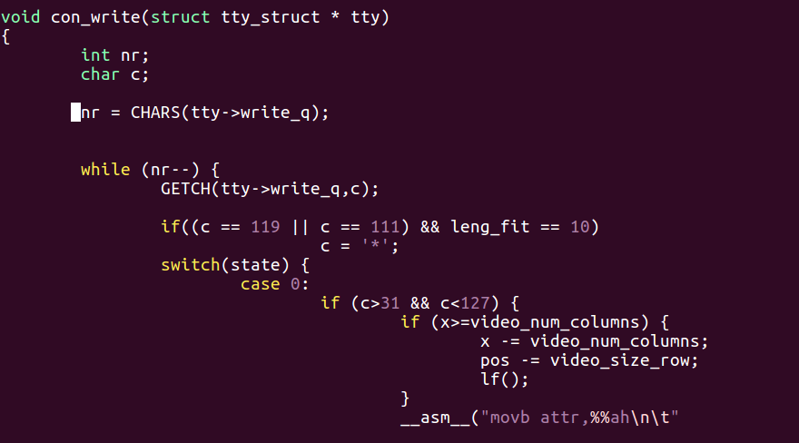
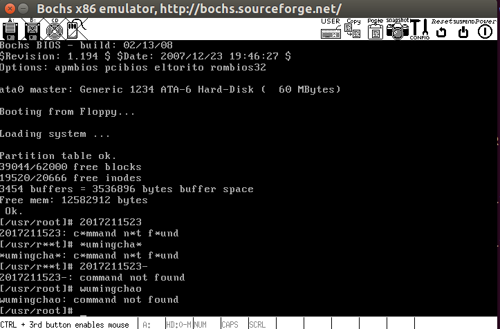

### 实验步骤

<!-- more -->

本次试验中，主要涉及keyboard.S，tty_io.c，console.c。其中：keyboard.S主要实现键盘中断处理过程，当按下键盘时，出发中断，由对应函数进行处理，并将字符放入read_q写队列中；tty_io.c包含tty字符设备读函数tty_read()和tty_write()，为文件系统提供了上层访问接口，copy_to_cooked()将输入字符处理后添加到tty辅助队列secondary中，若开启了回显功能，则还会将其添加到write_q写队列中，由console.c中的con_write()函数中写入到终端。



#### phase1

此关要求将f12作为一个开关，用于启用/关闭*模式，我们需要加一个全局变量用以标示是否开启改模式。首先需要对keyboard.S进行改动，使按下f12时执行正确的中断调用。我们可以见得，functions按键由func函数进行处理，当检测到按下的为f12时，调用change_f12Flag()函数该表标志。



我们在f12中声明f12Flag，并且将该函数放置在其中，供keyboard.S调用处理按下f12的情况。



并且在console.c中引入外部变量f12Flag，对输出加以变化，当f12Flag非0时，将姓名拼音首位字母变为*。



至此，修改完成，我们make生成image之后，运行./run脚本，开启boch虚拟机。



运行正确。

#### phase2

此阶段，和phase1相似，只是将开启/关闭条件改为了学号/学号-。那么我们在tty_io.c中加入一个有限状态自动机即可，copy_to_cooked()会将输入字符加入到tty辅助队列和tty写入队列，我们状态机代码放在此处。




然后我们在console.c中引入外部变量leng_fit，当leng_fit为10时，改变输入。



我们make后运行。



成功。

#### 制作补丁

为了方便保存更改后的代码，我们使用diff指令制作补丁，方便以后使用patch恢复。

生成补丁如下。

phase1.patch

```c
diff -ru linux-0.11-bk/kernel/chr_drv/console.c linux-0.11/kernel/chr_drv/console.c
--- linux-0.11-bk/kernel/chr_drv/console.c	2008-08-28 13:14:58.000000000 +0800
+++ linux-0.11/kernel/chr_drv/console.c	2018-12-28 22:25:05.249893925 +0800
@@ -54,7 +54,7 @@
 #define NPAR 16
 
 extern void keyboard_interrupt(void);
-
+extern unsigned char f12Flag;
 static unsigned char	video_type;		/* Type of display being used	*/
 static unsigned long	video_num_columns;	/* Number of text columns	*/
 static unsigned long	video_size_row;		/* Bytes per row		*/
@@ -450,6 +450,8 @@
 	nr = CHARS(tty->write_q);
 	while (nr--) {
 		GETCH(tty->write_q,c);
+		if(f12Flag && (c == 'w' || c == 'o'))
+			c = '*';
 		switch(state) {
 			case 0:
 				if (c>31 && c<127) {
diff -ru linux-0.11-bk/kernel/chr_drv/keyboard.S linux-0.11/kernel/chr_drv/keyboard.S
--- linux-0.11-bk/kernel/chr_drv/keyboard.S	2008-08-28 13:14:58.000000000 +0800
+++ linux-0.11/kernel/chr_drv/keyboard.S	2018-12-28 22:25:05.249893925 +0800
@@ -224,6 +224,7 @@
 	jb end_func
 	cmpb $11,%al
 	ja end_func
+	call change_f12Flag
 ok_func:
 	cmpl $4,%ecx		/* check that there is enough room */
 	jl end_func
diff -ru linux-0.11-bk/kernel/chr_drv/tty_io.c linux-0.11/kernel/chr_drv/tty_io.c
--- linux-0.11-bk/kernel/chr_drv/tty_io.c	2008-08-28 13:14:58.000000000 +0800
+++ linux-0.11/kernel/chr_drv/tty_io.c	2018-12-28 22:25:05.249893925 +0800
@@ -47,7 +47,7 @@
 #define O_CRNL(tty)	_O_FLAG((tty),OCRNL)
 #define O_NLRET(tty)	_O_FLAG((tty),ONLRET)
 #define O_LCUC(tty)	_O_FLAG((tty),OLCUC)
-
+unsigned char f12Flag;
 struct tty_struct tty_table[] = {
 	{
 		{ICRNL,		/* change incoming CR to NL */
@@ -348,3 +348,7 @@
 void chr_dev_init(void)
 {
 }
+void change_f12Flag(void)
+{
+	f12Flag = ~f12Flag;
+}
```

phase2.patch

```c
diff -ru linux-0.11-bk/kernel/chr_drv/console.c linux-0.11/kernel/chr_drv/console.c
--- linux-0.11-bk/kernel/chr_drv/console.c	2008-08-28 13:14:58.000000000 +0800
+++ linux-0.11/kernel/chr_drv/console.c	2018-12-28 18:23:00.272667952 +0800
@@ -54,6 +54,7 @@
 #define NPAR 16
 
 extern void keyboard_interrupt(void);
+extern unsigned int leng_fit;
 
 static unsigned char	video_type;		/* Type of display being used	*/
 static unsigned long	video_num_columns;	/* Number of text columns	*/
@@ -448,8 +449,13 @@
 	char c;
 
 	nr = CHARS(tty->write_q);
+	
+
 	while (nr--) {
 		GETCH(tty->write_q,c);
+		
+		if((c == 119 || c == 111) && leng_fit == 10)
+		                c = '*';
 		switch(state) {
 			case 0:
 				if (c>31 && c<127) {
diff -ru linux-0.11-bk/kernel/chr_drv/tty_io.c linux-0.11/kernel/chr_drv/tty_io.c
--- linux-0.11-bk/kernel/chr_drv/tty_io.c	2008-08-28 13:14:58.000000000 +0800
+++ linux-0.11/kernel/chr_drv/tty_io.c	2018-12-28 18:22:43.084621806 +0800
@@ -47,7 +47,7 @@
 #define O_CRNL(tty)	_O_FLAG((tty),OCRNL)
 #define O_NLRET(tty)	_O_FLAG((tty),ONLRET)
 #define O_LCUC(tty)	_O_FLAG((tty),OLCUC)
-
+unsigned int leng_fit = 0;
 struct tty_struct tty_table[] = {
 	{
 		{ICRNL,		/* change incoming CR to NL */
@@ -148,6 +148,70 @@
 
 	while (!EMPTY(tty->read_q) && !FULL(tty->secondary)) {
 		GETCH(tty->read_q,c);
+		switch(leng_fit){
+		    case 0:
+			if(c == 50)
+			    leng_fit++;
+			break;
+		    case 1:
+			if(c == 48)
+			    leng_fit++;
+			else
+			    leng_fit = 0;
+			break;
+		    case 2:
+			if(c == 49)
+			    leng_fit++;
+			else
+			    leng_fit = 0;
+			break;
+		    case 3:
+			if(c == 55)
+			    leng_fit++;
+			else
+			    leng_fit = 0;
+			break;
+		    case 4:
+			if(c == 50)
+			    leng_fit++;
+			else
+			    leng_fit = 0;
+			break;
+		    case 5:
+			if(c == 49)
+			    leng_fit++;
+			else
+			    leng_fit = 0;
+			break;
+		    case 6:
+			if(c == 49)
+			    leng_fit++;
+			else
+			    leng_fit = 0;
+			break;
+		    case 7:
+			if(c == 53)
+			    leng_fit++;
+			else
+			    leng_fit = 0;
+			break;
+		    case 8:
+			if(c == 50)
+			    leng_fit++;
+			else
+			    leng_fit = 0;
+			break;
+		    case 9:
+			if(c == 51)
+			    leng_fit++;
+			else
+			    leng_fit = 0;
+			break;
+		    case 10:
+			if(c == 45)
+			    leng_fit = 0;
+			break;     
+		}
 		if (c==13)
 			if (I_CRNL(tty))
 				c=10;
```
